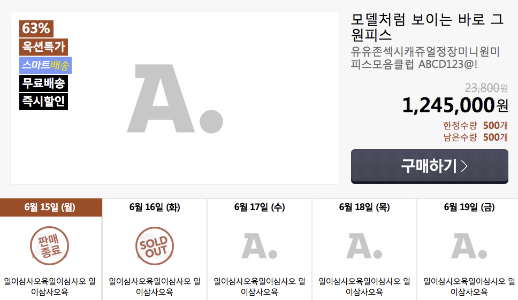
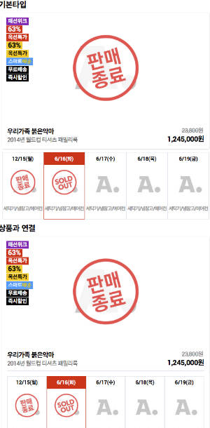

# [목차이동](https://github.com/Guide-Line/Auction-promotion-guide)

## <a name='list'>List(상품)</a>

  **웹**
  - [1단-소스이동](https://github.com/Guide-Line/Auction-promotion-guide/blob/master/list/goods_c1_list.html)

    

  - [2단-소스이동](https://github.com/Guide-Line/Auction-promotion-guide/blob/master/list/goods_c2_list.html)

  

  - [3단-소스이동](https://github.com/Guide-Line/Auction-promotion-guide/blob/master/list/goods_c3_list.html)

  

  - [4단-문구2개-소스이동](https://github.com/Guide-Line/Auction-promotion-guide/blob/master/list/goods_c4_list-문구2개.html)

  

  - [4단-소스이동](https://github.com/Guide-Line/Auction-promotion-guide/blob/master/list/goods_c4_list.html)

  

**모바일**
  - [1단-소스이동](https://github.com/Guide-Line/Auction-promotion-guide/blob/master/list/m_goods_c1_list.html)

     

  - [2단+캘린더-소스이동](https://github.com/Guide-Line/Auction-promotion-guide/blob/master/list/m_goods_c1_list_calendar.html)

     

  - [2단+문구1-소스이동](https://github.com/Guide-Line/Auction-promotion-guide/blob/master/list/m_goods_c2_list - 문구1개.html)

     

  - [2단-소스이동](https://github.com/Guide-Line/Auction-promotion-guide/blob/master/list/m_goods_c2_list.html)  

     

  - [1단+2단-소스이동](https://github.com/Guide-Line/Auction-promotion-guide/blob/master/list/m_goods_list.html)  

     

  - [1단 가로정렬-소스이동](https://github.com/Guide-Line/Auction-promotion-guide/blob/master/list/m_goods_r1_list.html)

     

 

